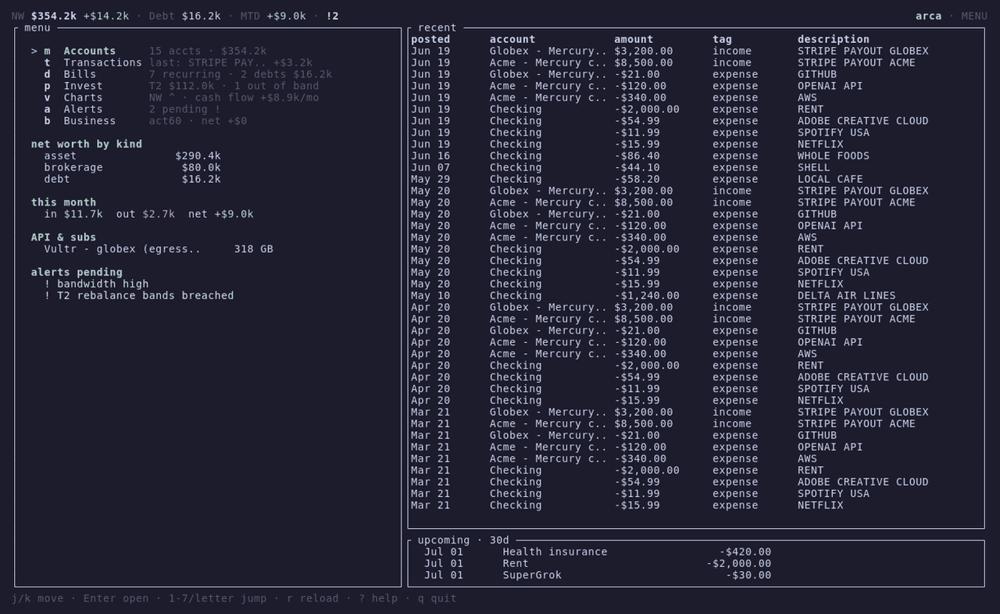

# arca

[](https://github.com/crodorg/arca/actions/workflows/ci.yml)
[](LICENSE)
[](https://doc.rust-lang.org/edition-guide/rust-2024/)
[](#)
[](#operator-sovereignty)

A self-hosted personal-finance daemon for OpenBSD. One small Rust binary tracks
your debt, income, investments, subscriptions, API spend, and per-business P&L —
24/7, on your own hardware, with your credentials never leaving the box.
Read it through a vim-style terminal client over a Unix socket, or message it
from your phone over XMPP. Deterministic, scriptable, no cloud, no phone-home.

`arca` — Spanish for *vault*.



*A scripted tour of the TUI against entirely fictional data — generated by
`arca-daemon seed-demo`, so no real finances are shown. Reproduce it with
[`demo/record.sh`](demo/record.sh).*

> **Heads-up:** this is a personal project, built around one operator's setup and
> shared in case it's useful. It is opinionated and OpenBSD-first, and several
> "customizations" still mean editing Rust (see [Extending](#extending-arca)).
> Read it as a working reference design, not a turnkey consumer app.

## Why

Aggregators want your bank logins on their servers. Spreadsheets rot. `arca`
keeps the whole picture — net worth, debt paydown, portfolio drift, recurring
bills, business cash flow — in one SQLite file on a machine you control, and
talks to bank/SaaS APIs directly from there. It is built to run for years next
to `pf` and `unbound` on a router-class OpenBSD host, sandboxed with
`pledge(2)` and `unveil(2)`, with every secret encrypted at rest under `age`.

## Features

- **One static binary daemon + thin clients.** No microservices, no
  daemons-talking-to-daemons, no container runtime. `arca-daemon` schedules
  polls, runs the alert engine, and serves RPC; `arca` is the TUI **and** the
  scriptable CLI.
- **~12 pluggable providers, one trait.** `manual`, `plaid` (banks via
  `/transactions/sync`), `mercury`, `stripe`, `openai_usage`, `openrouter`,
  `scrapecreators`, `postmark`, `gold_spot`, `xmr_spot`, `vultr` (egress),
  `vultr_cost` (fleet run-rate). Adding a backend is **one file** implementing
  `Provider` plus one match arm — core never learns a provider's name.
- **Recurring detection, no scraping.** Subscriptions, bills, and recurring debt
  payments are *derived* from your transaction stream: payees are normalized,
  cadence (weekly→yearly) is inferred from the median inter-charge gap, and each
  series predicts its next date. You confirm/label series (`sub`/`bill`/`debt`)
  and they flow into the calendar and report.
- **Three-tier investment model with drift alerts.** A hold-forever antifragile
  backbone (Tier 1), a liquid permanent-portfolio operations layer of three
  ~33% sleeves with 22%/44% rebalance bands (Tier 2), and operating capital
  (Tier 3). The drift engine computes exactly how much to buy/sell to rebalance.
- **An alert engine that tells you what to *do*.** `provider.stale`,
  `balance.low`, `bandwidth.high`, `pp.band_breach`, and calendar `reminder`
  rules. Breaches are recorded to the DB; delivery is out of band.
- **Reports you actually receive.** A monthly Markdown report and a weekly
  RFC 5545 `.ics` calendar digest (hand-rolled, zero calendar-crate deps),
  written to disk and pushed to you over XMPP — "Add to Calendar" just works.
- **A real TUI.** `ratatui` + `crossterm`: a space-filling main menu with live
  teasers, then full-screen Accounts / Transactions / Bills / Invest / Charts
  (braille net-worth trend) / Alerts / Business views. Vim keys throughout.
- **Query it from anywhere, safely.** An optional ~600-line XMPP bridge maps a
  fixed allowlist of read verbs to the daemon — no inbound port opened on the
  host, no command interpretation, exact-syntax only.
- **Money is integer cents, end to end.** A `Cents(i64)` newtype in every public
  API. No floats in money math, ever. Timestamps are unix-seconds UTC.

## Security model

This is the part that matters for a daemon holding bank and SaaS credentials.

- **Sandboxed with `pledge(2)` + `unveil(2)`.** After setup the daemon drops to
  `stdio rpath wpath cpath flock fattr inet unix dns` — **no `proc`, no `exec`**.
  It spawns nothing. `unveil` exposes only the DB, the log dir, `/etc/arca` (r),
  and a scratch dir. On non-OpenBSD targets these are no-ops, so it still builds
  and runs for development.
- **Runs as a dedicated `_arca` user**, no shell, never root, no `sudo`.
- **Secrets encrypted at rest under `age`.** One file, `/etc/arca/secrets.age`,
  decrypted into memory at start and never written back. The key is mode `0400`,
  `_arca`-owned. No secret in argv, no secret in env beyond the startup read,
  none logged.
- **Two Unix sockets, capability-split.** `read.sock` serves snapshots and
  queries; `write.sock` adds mutations and is gated by a `getpeereid(2)` peer-UID
  check — not just mode bits — so only the operator's UID can write. If the
  operator UID is unset the write socket **fails closed**.
- **Loopback-only TCP, by construction.** The TCP listener has no peer-UID auth
  (UID is meaningless over TCP), so it refuses any non-loopback bind at startup.
  Remote access is an SSH-tunneled TUI to the UID-gated socket, never raw TCP.
- **Honest failure.** No silent fallbacks. If a provider is down, the response
  says so. A malformed `secrets.age` starts the daemon *without* secrets and logs
  it — it never fails open.

### Operator sovereignty

No telemetry. No phone-home. No "anonymized" anything. No LLM/model API is called
in any command path — commands match a known verb and execute, or fail visibly.
Your data is one SQLite file you can back up, sign, and move.

## Status

The core is built and runs: schema + migrations, the provider trait and
registry, the scheduler, dual-socket RPC, the alert engine, recurring detection,
the Markdown + `.ics` report engines, the full TUI, and the XMPP bridge
(query + push). See [`docs/providers.md`](docs/providers.md) for the
authoritative per-provider state and [`docs/architecture.md`](docs/architecture.md)
for the design.

## Requirements

- OpenBSD (developed and run on 7.9). Builds and runs on other Unixes for
  development — `pledge`/`unveil` compile to no-ops off OpenBSD.
- Rust 2024 edition (`pkg_add rust`).
- `sqlite3` and `age` from ports (`pkg_add sqlite3 age`).
- For the XMPP bridge: an XMPP account on a server you reach, and
  `py3-slixmpp` (or `pip install slixmpp`).

## Install

```sh
doas pkg_add rust sqlite3 age
git clone https://github.com/crodorg/arca /tmp/arca
cd /tmp/arca
cargo build --release --workspace

doas install -d -o _arca -g _arca /var/arca /var/log/arca /etc/arca
doas install -m 0755 target/release/arca-daemon /usr/local/sbin/
doas install -m 0755 target/release/arca        /usr/local/bin/
doas install -m 0755 rc.d/arca /etc/rc.d/arca

doas rcctl enable arca
doas rcctl start arca
```

Create the service user once: `doas useradd -d /var/arca -s /sbin/nologin -L daemon _arca`.

## Configure

```sh
doas install -m 0640 -o _arca -g _arca etc/arca.conf.example /etc/arca/arca.conf
doas $EDITOR /etc/arca/arca.conf      # set operator_uid, tz_display, paths
```

Secrets go in `/etc/arca/secrets.age` (TOML, then `age`-encrypted), one
`secret_ref` per provider. `operator_uid` (`id -u <you>`) gates the write
socket; leave it set or the write socket fails closed. See
[`etc/arca.conf.example`](etc/arca.conf.example) and
[`docs/providers.md`](docs/providers.md) for credential shapes.

## CLI

The `arca` binary is both the TUI and a scriptable one-shot client. Read verbs:

```sh
arca money                 # net worth + cash snapshot
arca debt --scope month    # open balances + scheduled debt service
arca pp                    # permanent-portfolio drift + backbone
arca tx --tag income       # transactions, filterable
arca recurring             # detected subs/bills/debts
arca business acme         # per-business P&L
arca alerts                # the undelivered alert queue
arca health                # liveness + last-poll status
arca export > tx.csv       # transactions as CSV
```

Write verbs (operator-only, over the UID-gated socket):

```sh
arca provider-set     --kind plaid --label "Plaid - Main" --secret-ref plaid_main_access_token
arca alert-set        --name low-checking --rule '{"kind":"balance.low","account":"Checking","min_cents":50000}'
arca subscription-set --name Rent --amount -2000 --cadence monthly --next 2026-07-01
arca recurring-confirm --match-key netflix --label sub --name Netflix
arca refresh          --provider plaid
```

`arca --cmd '{json}'` sends a raw RPC request; everything prints JSON (`export`
prints CSV), so it composes into scripts and status bars.

## Extending arca

Much of arca is **data, not code** — accounts, businesses, alert rules,
subscriptions, and provider rows are created at runtime over the write socket, no
recompile. The examples below add custom values to the built-in features; the
limits are called out honestly.

**Add accounts and tag them into the portfolio.** Asset class and capital tier
(`t1`/`t2`/`t3`) are free-form strings you set per account — that's how a holding
enters the Tier-1 backbone or a Tier-2 permanent-portfolio sleeve:

```sh
# A cash account, then promote it into a PP sleeve:
arca --cmd '{"kind":"manual.upsert_account","name":"Checking","account_kind":"asset","asset_class":"cash"}'
arca --cmd '{"kind":"manual.upsert_account","name":"Brokerage","account_kind":"brokerage","asset_class":"equity","tier":"t2"}'
# Snapshot a balance the daemon can't fetch (e.g. a retirement account):
arca --cmd '{"kind":"manual.snapshot","account_name":"401k","amount":"8200.00"}'
```

**Add a business (P&L tag) and bind data to it:**

```sh
arca business-set --tag acme --name "Acme LLC"
arca provider-set --kind mercury --label acme --config '{"business_tag":"acme"}' --secret-ref mercury_acme_token
```

**Declare a fixed obligation** (rent, insurance) so it shows in Bills, the
calendar, and the report — without being counted as debt or net worth:

```sh
arca subscription-set --name Rent --amount -2000 --cadence monthly --next 2026-07-01
```

**Write custom alert rules.** Rules are JSON you author. Watch any account by
name, or cap a Vultr instance's egress:

```sh
arca alert-set --name low-checking \
  --rule '{"kind":"balance.low","account":"Checking","min_cents":50000}'
arca alert-set --name pay-rent \
  --rule '{"kind":"reminder","day_of_month":1,"hour_ast":9,"message":"Pay rent"}'
```

**Tune the periodic engines** in `arca.conf` — report day/hour, digest weekday,
lookahead window, poll cadences — all without touching code.

### Limits (read before you customize)

- **New data *sources* are code, not config.** A bank/SaaS arca doesn't already
  speak means implementing the `Provider` trait: one file in
  `crates/arca-daemon/src/providers/<name>.rs` plus one `match` arm in
  `registry.rs` (see [`docs/providers.md`](docs/providers.md)). It's a clean,
  small contract — but it *is* a recompile, not a config edit.
- **Alert rule *kinds* are a fixed enum.** You can author unlimited rules of the
  built-in kinds, but a genuinely new predicate is a code change.
- **Some defaults are still opinionated** (paths, the three-tier PP math, the
  22/44 rebalance bands). They're parameters in code, not all surfaced as config
  yet.
- **It's a personal project.** Expect rough edges and one-operator assumptions.
  Clean PRs — especially new providers and config-ifying hardcoded knobs — are
  welcome.

### Roadmap: make sources dynamic

The direction is to stop requiring a recompile for new data. A generic
HTTP/JSON provider configured entirely from `config_json` (endpoint, auth header,
a small JSONPath-style mapping to balances/transactions) would let many sources be
added as a *provider row* instead of a Rust file. The `Provider` trait is already
the only contract core depends on, so this is an additive change, not a rewrite.

### A note on Plaid

The `plaid` provider is real and works, but **Plaid is not a general-consumer
product** — production access requires a Plaid-approved developer account, and
their consumer-facing terms are aimed at businesses, not individuals linking their
own accounts. This integration exists because of a limited free **Trial** tier
(a handful of production items), which is the exception, not something most people
can sign up for. If you don't have Plaid developer/Trial access, treat `plaid` as
illustrative and use the `manual` provider (`manual.snapshot` /
`manual.insert_transaction`) to keep balances and transactions current by hand or
from your own scripts. The sandbox runbook in
[`docs/providers.md`](docs/providers.md) lets you exercise the whole pipeline with
synthetic data and no bank approval.

## TUI keys

| Key | Action |
|-----|--------|
| `1`–`7` / letter | Open a view (`m` Accounts · `t` Transactions · `d` Bills · `p` Invest · `v` Charts · `a` Alerts · `b` Business) |
| `j`/`k`, `C-d`/`C-u`, `gg`/`G` | Move / page / top / bottom |
| `Enter` | Open the highlighted menu tile |
| `h` / `Esc` | Back to the menu |
| `o` | Home (menu) |
| `/` | Filter rows · `:` command bar (`:label`, `:rename`, `:ignore`) |
| `?` | Help overlay |
| `q` | Quit (from the menu) / back out (from a view) |

## XMPP bridge (optional)

`bridge/arca-xmpp.py` is an outbound XMPP client (slixmpp) that runs on the host
and dials your XMPP server — it opens **no inbound port**. Messages are matched
against a fixed read-verb allowlist (`money`, `debt`, `pp`, `tx`, `business`,
`alerts`, `health`) and nothing else runs; unrecognized input gets a usage hint.
A push loop delivers what the daemon only records — new alerts and report/`.ics`
files — to your JID. It uses the read socket only; mutations require you at the
host. See [`bridge/arca-xmpp.conf.example`](bridge/arca-xmpp.conf.example).

## Development

```sh
cargo build --workspace            # builds off OpenBSD too (sandbox = no-op)
cargo test  --workspace            # unit + wiremock provider tests
cargo clippy --workspace -- -D warnings
cargo fmt
python3 bridge/test_arca_xmpp.py   # bridge allowlist + push-dedup tests
```

Provider tests use recorded HTTP fixtures (`wiremock`); no live API calls in CI.
Adding a provider is documented in [`docs/providers.md`](docs/providers.md).

## License

MIT. See [`LICENSE`](LICENSE).
